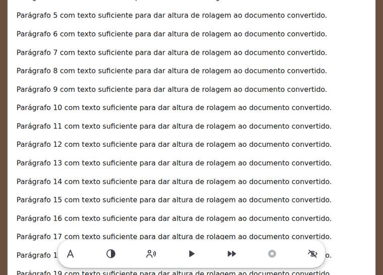
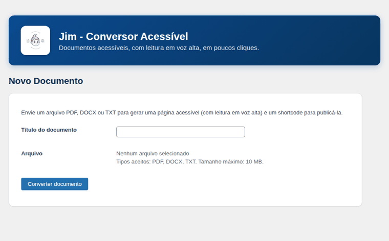

# Jim — Conversor Acessível

Plugin WordPress que transforma arquivos **PDF**, **Word (.docx)** e **TXT** em páginas de
leitura acessíveis (WCAG 2.1 AA), com leitura em voz alta pelo próprio navegador. Cada
conversão fica guardada no banco do site (Custom Post Type) e pode ser publicada em
qualquer página via shortcode.

**[Site do plugin](https://maycristina.github.io/jim-conversor-acessivel/)** ·
[Relatar um problema](https://github.com/maycristina/jim-conversor-acessivel/issues) ·
Versão 1.0.0 · GPL v2 ou posterior

---

## Como fica para quem lê

Uma barra flutuante acompanha o leitor enquanto ele rola o documento: tamanho do texto,
tema de leitura (Claro, Sépia e Escuro), alto contraste, escolha da voz, ouvir/pausar,
velocidade, parar — e um botão para ocultar a barra inteira.



## Como fica no painel

O envio mostra o arquivo escolhido, o estado de conversão enquanto o arquivo é processado,
e o aviso de conclusão com o link para o documento e seu shortcode.



---

## Instalação

1. Baixe ou clone este repositório para `wp-content/plugins/jim-conversor-acessivel/`:
   ```bash
   git clone https://github.com/maycristina/jim-conversor-acessivel.git
   cd jim-conversor-acessivel
   composer install --no-dev
   ```
2. Ative o plugin em **Plugins › Plugins instalados**.
3. Vá em **Jim › Novo Documento** e envie um PDF, DOCX ou TXT.
4. Copie o shortcode gerado e cole em qualquer página ou post.

> As dependências de leitura de arquivos (`smalot/pdfparser` e `phpoffice/phpword`) são
> instaladas via Composer e não são versionadas aqui. Rode `composer install` antes de ativar.

## Shortcodes

| Shortcode | O que faz |
|---|---|
| `[documento_acessivel id="123"]` | Publica o documento convertido, com a barra de controles de leitura. |
| `[jimca_instalacoes]` | Mostra o número de instalações ativas informado pela API do WordPress.org. |

## Requisitos

| | |
|---|---|
| WordPress | 6.0 ou superior |
| PHP | 7.4 ou superior |
| Formatos aceitos | PDF com texto selecionável, `.docx`, `.txt` |
| Não suportado | PDF escaneado (apenas imagem) e o formato antigo `.doc` |

## Estrutura do plugin

```
jim-conversor-acessivel.php    Bootstrap: headers do WP, autoload, constantes
includes/
  class-plugin.php             Orquestra o carregamento dos componentes
  class-activator.php          Ativação (opções padrão)
  class-deactivator.php
  class-post-type.php          CPT "jimca_documento" + coluna com o shortcode
  class-converter.php          Dispatcher por extensão + checagem de extensões do PHP
  class-converter-interface.php
  class-converter-exception.php
  converters/
    class-pdf-converter.php    smalot/pdfparser
    class-word-converter.php   phpoffice/phpword
    class-txt-converter.php
  class-shortcode.php          [documento_acessivel] + ícones SVG do player
  class-install-badge.php      [jimca_instalacoes] (API do WordPress.org)
admin/
  class-admin.php              Upload, Configurações e Tutorial
templates/
  document-viewer.php          Visualizador acessível (ARIA, player de leitura)
assets/
  css/frontend.css             Visualizador e player (tokens do Material Design 3)
  css/admin.css                Telas do painel
  js/frontend.js               Player: menus, temas, Web Speech API
  js/admin.js                  Feedback de arquivo escolhido e de conversão
docs/                          Site do plugin (GitHub Pages)
readme.txt                     Formato oficial do diretório WordPress.org
uninstall.php                  Limpeza ao desinstalar
```

## Decisões de arquitetura

**Custom Post Type, não tabela própria.** Reaproveita `wp_posts`/`wp_postmeta`, revisões,
export e backup nativos do WordPress — e a tela de listagem do admin sai pronta.

**Conversão em PHP, não via API externa.** Evita custo recorrente e dependência de
internet no momento da conversão. Nenhum documento do usuário sai do servidor dele.

**Leitura em voz alta pela Web Speech API do navegador.** Sem custo por caractere e sem
enviar o texto para um serviço de terceiros; a voz é a que o leitor já tem instalada.

**O conteúdo convertido não passa por `the_content`.** Rodar `do_shortcode()` sobre texto
extraído de um arquivo enviado permitiria que um documento com algo como `[shortcode]`
executasse shortcodes do site sem intenção. O HTML já vem sanitizado com `wp_kses_post()`
no momento da conversão.

**Temas explícitos, sem seguir `prefers-color-scheme`.** Quem decide o tema de leitura é o
administrador (padrão do site) ou o próprio leitor — a escolha do leitor vale só para o
navegador dele e não altera o padrão.

## Acessibilidade

- Contraste conferido em todos os pares de texto e fundo dos três temas (mínimo 4,5:1).
- Navegação completa por teclado, foco sempre visível, menus que fecham no `Esc`
  devolvendo o foco ao botão de origem.
- Alvos de toque de 48 px seguindo o Material Design 3, com redução controlada até 40 px
  em telas muito estreitas (acima do mínimo de 24×24 do WCAG 2.2).
- Estrutura semântica com `role`/`aria` e avisos anunciados por região `aria-live`.
- `prefers-reduced-motion` respeitado.
- Sem JavaScript, o texto continua inteiramente legível; apenas os controles não aparecem.

## Licença

GPL v2 ou posterior. Veja [LICENSE](LICENSE).

Desenvolvido por [Mayara Nascimento](https://github.com/maycristina).
