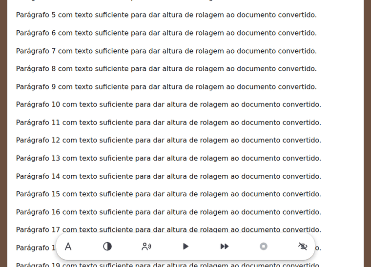
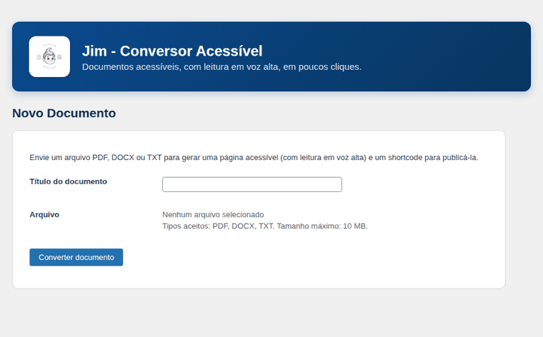

# Jim — Conversor Acessível

Plugin WordPress que transforma arquivos **PDF**, **Word (.docx)**, **Markdown** e **TXT** em páginas de
leitura acessíveis (WCAG 2.1 AA), com leitura em voz alta pelo próprio navegador. Cada
conversão fica guardada no banco do site (Custom Post Type) e pode ser publicada em
qualquer página via shortcode.

**[Site do plugin](https://jim.mabo.cc/)** ·
[WordPress.org](https://wordpress.org/plugins/jim-conversor-acessivel/) ·
[Relatar um problema](https://github.com/maycristina/jim-conversor-acessivel/issues) ·
Versão 2.0.0 · GPL v2 ou posterior

---

> **Idiomas:** o código-fonte está em inglês; o pacote traz **português (pt_BR)**, **espanhol (es_ES)**, **francês (fr_FR)**, **mandarim simplificado (zh_CN)**, **hindi (hi_IN)**, **russo (ru_RU)** e **alemão (de_DE)** em `languages/`, escolhidos pelo idioma do site/usuário. **Log e IA:** em
> Configurações há um log de atividade ao vivo, as chaves de IA (OpenRouter, Claude, OpenAI, Gemini e
> DeepSeek, criptografadas) e o **tutor de IA** para os leitores. Detalhes no
> [CHANGELOG.md](CHANGELOG.md). Para contribuir, veja [CONTRIBUTING.md](CONTRIBUTING.md).


## Como fica para quem lê

Uma barra flutuante acompanha o leitor enquanto ele rola o documento: sumário, tamanho do
texto, tema de leitura (Claro, Sépia e Escuro), alto contraste, escolha da voz, ouvir/pausar,
velocidade, parar — e um botão para ocultar a barra inteira.

- **Sumário lateral:** quando o documento tem títulos, o primeiro botão da barra abre um
  painel à esquerda com a lista de partes, capítulos e seções, marcando a seção que está
  sendo lida. Os títulos vêm dos estilos de título do Word (Título 1, Título 2…) ou do
  sumário (marcadores) do PDF. Sem JavaScript, o sumário aparece como uma lista antes do texto.
- **Alto contraste:** fundo preto, texto branco e destaques em amarelo, a partir de qualquer
  tema, inclusive o padrão.



## Como fica no painel

O envio mostra o arquivo escolhido, o estado de conversão enquanto o arquivo é processado,
e o aviso de conclusão com o link para o documento e seu shortcode.



---

## Instalação

O plugin está no diretório oficial do WordPress:
**[wordpress.org/plugins/jim-conversor-acessivel](https://wordpress.org/plugins/jim-conversor-acessivel/)**

1. No painel do WordPress, vá em **Plugins › Adicionar novo plugin** e busque por **Jim Conversor Acessível**.
2. Clique em **Instalar agora** e depois em **Ativar**.
3. Vá em **Jim › Novo Documento** e envie um PDF, DOCX, Markdown ou TXT.
4. Copie o shortcode gerado e cole em qualquer página ou post.

As atualizações chegam pela tela de Plugins, como em qualquer outro plugin do diretório.

### A partir do código-fonte

Para desenvolver ou testar uma versão ainda não publicada, clone o repositório em
`wp-content/plugins/jim-conversor-acessivel/` e instale as dependências:

```bash
git clone https://github.com/maycristina/jim-conversor-acessivel.git
cd jim-conversor-acessivel
composer install --no-dev
```

Depois ative o plugin em **Plugins › Plugins instalados**.

> As dependências de leitura de arquivos (`smalot/pdfparser` e `phpoffice/phpword`) são
> instaladas via Composer e não são versionadas aqui. Rode `composer install` antes de ativar.

### Gerar o pacote de novo

Depois de mudar o código, faça o commit e rode na raiz do repositório:

```bash
bin/build-zip.sh
```

O script monta o zip a partir do último commit (alterações não commitadas ficam de fora),
instala as dependências de produção e remove delas testes, exemplos e histórico git. Depois
faça o commit de `dist/jim-conversor-acessivel.zip`. Requer `git`, `composer` e `zip`.

## Shortcodes

| Shortcode | O que faz |
|---|---|
| `[documento_acessivel id="123"]` | Publica o documento convertido, com a barra de controles de leitura. |
| `[jimca_instalacoes]` | Mostra o número de instalações ativas informado pela API do WordPress.org. |

## Requisitos

| | |
|---|---|
| WordPress | 6.0 ou superior |
| PHP | 7.4 ou superior |
| Formatos aceitos | PDF com texto selecionável, `.docx`, `.txt`, `.md` (Markdown) |
| Não suportado | PDF escaneado (apenas imagem) e o formato antigo `.doc` |

## Limites de imagens e requisitos do servidor

Converter muitas imagens é o que mais pesa no servidor. Por padrão o plugin inclui até
**100 imagens** e **60 MB** de imagens por documento (configurável em **Jim › Configurações**),
e para a extração ao chegar perto do tempo ou da memória do PHP. O texto é sempre convertido
por inteiro; o aviso depois da conversão lista cada causa de imagem que ficou de fora
(JPEG 2000, fax, limite atingido…). Requisitos recomendados (PHP 8.1+, 512 MB de memória,
300 s, upload de 32 MB) e o quadro de conferência estão em
[`documentacao/REQUISITOS-DO-SISTEMA.md`](documentacao/REQUISITOS-DO-SISTEMA.md).

## Markdown e envio de vários arquivos

Arquivos `.md` são convertidos em HTML (títulos, listas, tabelas, código, links; HTML dentro do
arquivo vira texto). TXT e MD podem ser enviados **vários de uma vez** (até 20): cada um vira
um documento e o aviso traz a lista de shortcodes, um por linha. PDF e DOCX são enviados um por vez.

## SEO, marcador e tutor de IA

- **SEO automático:** a página que tem o shortcode ganha descrição, Open Graph, Twitter Card
  e dados estruturados (JSON-LD). Desliga sozinho se Yoast, Rank Math, All in One SEO ou
  SEOPress estiverem ativos.
- **Marcador visual:** o leitor seleciona um trecho e o marca em quatro cores; as marcações
  ficam salvas no navegador dele.
- **Tutor de IA (opcional, desligado por padrão):** um balão na página do documento onde o leitor
  pergunta, por texto ou voz, sobre aquele documento. O administrador define nome, personalidade,
  instruções e boas-vindas, o provedor (chave própria, criptografada) e onde ele aparece
  (`tutor="sim|nao"` no shortcode). As respostas chegam enquanto são escritas (streaming), perguntas
  repetidas são respondidas por respostas guardadas, e há limites por hora e por dia. O que é enviado
  ao provedor está em `readme.txt` › Privacy.
- **Conversões longas:** PDF e DOCX são convertidos em segundo plano, com barra de progresso; PDFs em
  etapas de até 20 s que retomam de onde pararam, para hospedagens que encerram requisições aos 60 s.

Os testes de formatos, fluxos e limitações estão em
[`documentacao/TESTES-E-LIMITACOES.md`](documentacao/TESTES-E-LIMITACOES.md).

## Modo de exibição

Em **Documentos Acessíveis**, a Edição rápida de cada documento define se ele é um **leitor**
(barra flutuante, voz, temas, sumário) ou um **post de blog** (página HTML com tempo de leitura,
ouvir e compartilhar). Só o painel configura isso; o shortcode não tem atributo para o modo.

## PDF: títulos, sumário impresso e marcação de páginas

- **Sumário impresso:** linhas no formato "título ........ 87" viram uma lista (título, pontilhado
  e número da página), mesmo quando a extração de texto do PDF quebra a linha no meio do título,
  joga o número da página para a linha de baixo ou cola nele o número da próxima seção. Um item
  que começa numa página e termina na seguinte é reunido. É preciso um pontilhado de 4 ou mais
  pontos: reticências comuns ("...") continuam sendo texto.

- **Títulos:** se o PDF tem sumário (os marcadores que aparecem na barra lateral do leitor de
  PDF), cada entrada vira um título no texto convertido, no nível certo (parte → capítulo →
  seção). Quando o título também está impresso na página, ele é reconhecido e não sai
  duplicado. Destinos por nome e por ação "ir para" também são lidos.
- **Remover a marcação de páginas:** na tela **Novo Documento**, a opção *Remover a marcação de
  páginas* tira os "Página 1", "Página 2"… do texto. Com ela, o texto sai corrido como num
  livro digital: frases cortadas na virada da página são reunidas, e a numeração impressa no
  topo ou no rodapé ("12", "- 12 -", "Página 12 de 300") é descartada. Sem marcar a opção, a
  conversão continua como antes. A numeração impressa no topo ou no rodapé sai nos dois modos.
- **Imagens na página certa:** as imagens entram na página em que são desenhadas, na ordem do
  desenho. Muitos geradores (LibreOffice, Word…) declaram todas as imagens do documento em todas
  as páginas; seguir só essa lista fazia todas caírem na primeira página.

## Imagens

As imagens do PDF e do DOCX entram no documento convertido (dá para desligar em
**Jim › Configurações › Imagens do documento**).

| | DOCX | PDF |
|---|---|---|
| Posição | No mesmo ponto do texto em que estava no Word | Ao final do texto da página em que aparece |
| Descrição (texto alternativo) | A escrita no Word ("Editar Texto Alt") é mantida; imagens marcadas como decorativas ficam com `alt=""` | Não é lida do PDF: recebe um texto provisório ("Imagem 1 da página 3 (sem descrição)") |
| Formatos | JPEG, PNG, GIF, WebP; BMP e TIFF são convertidos para PNG quando o GD do PHP está disponível | JPEG; imagens RGB, cinza ou CMYK de 8 bits, cinza de 1/2/4 bits e com paleta (viram PNG), inclusive dentro de grupos (Form XObjects) e sem o campo opcional `/Type` (Ghostscript). JPEG 2000, fax (CCITT/JBIG2) e imagens embutidas no conteúdo (`BI … EI`) ficam de fora e entram na contagem do aviso |

- Depois da conversão, o aviso no painel diz quantas imagens entraram e **quantas estão
  sem descrição**. Descreva-as editando o documento: quem usa leitor de tela depende disso.
- A leitura em voz alta lê a descrição das imagens ("Imagem: …"), mas pula as decorativas
  e as que ainda estão com o texto provisório.
- Cada imagem vira um anexo da **Biblioteca de Mídia** (com miniaturas e texto alternativo),
  ligado ao documento. Os anexos são apagados quando o documento é excluído permanentemente
  (esvaziar a lixeira) ou quando o plugin é desinstalado. Documentos convertidos antes da
  v2.0 continuam com as imagens em `uploads/jimca-documentos/imagens/`.
- **Lightbox:** clicar numa imagem do documento a abre ampliada, com setas para navegar entre
  as imagens, descrição e contador. Fecha com `Esc`, no botão ou clicando fora, e devolve o
  foco à imagem de origem.
- Uma imagem repetida é gravada uma vez só; no PDF, a mesma imagem em várias páginas (um
  logotipo, por exemplo) aparece só na primeira. Imagens menores que 32 px são tratadas
  como enfeite e ignoradas. Limite de 300 imagens por documento.

## Estrutura do plugin

```
jim-conversor-acessivel.php    Bootstrap: headers do WP, autoload, constantes
includes/
  class-plugin.php             Orquestra o carregamento dos componentes
  class-activator.php          Ativação (opções padrão)
  class-deactivator.php
  class-post-type.php          CPT "jimca_documento" + coluna com o shortcode
  class-converter.php          Dispatcher por extensão + checagem de extensões do PHP
  class-converter-interface.php
  class-converter-exception.php
  class-image-store.php        Grava as imagens extraídas e gera o  de cada uma
  converters/
    class-pdf-converter.php    smalot/pdfparser
    class-pdf-image-extractor.php  Imagens do PDF em JPEG/PNG
    class-pdf-outline.php      Sumário (marcadores) do PDF, para os títulos
    class-word-converter.php   phpoffice/phpword
    class-docx-image-descriptions.php  Texto alternativo das imagens do .docx
    class-txt-converter.php
  class-shortcode.php          [documento_acessivel] + ícones SVG do player
  class-install-badge.php      [jimca_instalacoes] (API do WordPress.org)
  class-ai.php                 Chaves, requisições e streaming dos provedores de IA
  class-tutor.php              Tutor de IA: prompt, trechos do documento, limites, respostas guardadas
  class-conversion-job.php     Conversão em segundo plano, em etapas, com progresso
  class-limits.php             Limites de imagens, tempo e memória
  class-log.php                log de atividade (Configurações)
  class-privacy.php            texto sugerido de política de privacidade
admin/
  class-admin.php              Upload, Configurações e Tutorial
templates/
  document-viewer.php          Visualizador acessível (ARIA, player de leitura)
assets/
  css/frontend.css             Visualizador e player (tokens do Material Design 3)
  css/admin.css                Telas do painel
  js/frontend.js               Player: menus, temas, Web Speech API
  js/admin.js                  Envio com progresso (conduz as etapas da conversão)
  js/tutor.js                  Balão do tutor: conversa, streaming, voz
bin/build-zip.sh               Gera o pacote instalável em dist/
dist/jim-conversor-acessivel.zip  Pacote pronto para "Enviar plugin" (com vendor/)
docs/                          Site do plugin (GitHub Pages, jim.mabo.cc)
readme.txt                     Formato oficial do diretório WordPress.org
uninstall.php                  Limpeza ao desinstalar
```

## Decisões de arquitetura

**Custom Post Type, não tabela própria.** Reaproveita `wp_posts`/`wp_postmeta`, revisões,
export e backup nativos do WordPress — e a tela de listagem do admin sai pronta.

**Conversão em PHP, não via API externa.** Evita custo recorrente e dependência de
internet no momento da conversão. Nenhum documento do usuário sai do servidor dele.

**Leitura em voz alta pela Web Speech API do navegador.** Sem custo por caractere e sem
enviar o texto para um serviço de terceiros; a voz é a que o leitor já tem instalada.

**O conteúdo convertido não passa por `the_content`.** Rodar `do_shortcode()` sobre texto
extraído de um arquivo enviado permitiria que um documento com algo como `[shortcode]`
executasse shortcodes do site sem intenção. O HTML já vem sanitizado com `wp_kses_post()`
no momento da conversão.

**Temas explícitos, sem seguir `prefers-color-scheme`.** Quem decide o tema de leitura é o
administrador (padrão do site) ou o próprio leitor — a escolha do leitor vale só para o
navegador dele e não altera o padrão.

## Acessibilidade

- Contraste conferido em todos os pares de texto e fundo dos três temas (mínimo 4,5:1).
- Navegação completa por teclado, foco sempre visível, menus que fecham no `Esc`
  devolvendo o foco ao botão de origem.
- Alvos de toque de 48 px seguindo o Material Design 3, com redução controlada até 40 px
  em telas muito estreitas (acima do mínimo de 24×24 do WCAG 2.2).
- Estrutura semântica com `role`/`aria` e avisos anunciados por região `aria-live`.
- `prefers-reduced-motion` respeitado.
- Sem JavaScript, o texto continua inteiramente legível; apenas os controles não aparecem.

## Licença

GPL v2 ou posterior. Veja [LICENSE](LICENSE).

Desenvolvido por [Mayara Nascimento](https://github.com/maycristina).

---

## ⭐ Apoie o projeto

Se este projeto foi útil para você, por favor considere dar uma **estrela (star)** no repositório! Isso ajuda o projeto a crescer e alcançar mais desenvolvedores.
